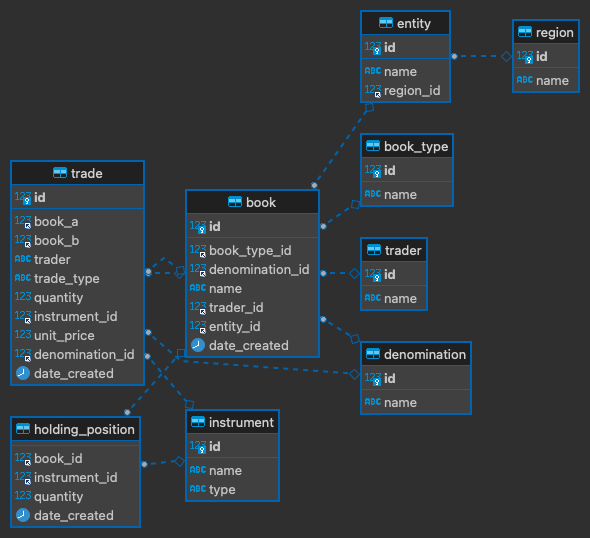

# Trade Book Project
This is an ugly website of the project for the lovely course Principles of Database Systems. Professor Olmsted did say that this is not a beauty contest :)

## Introduction
- A trading book is the portfolio of financial instruments held by a brokerage or bank. Full definition can be found in the following link: [Investopedia definition of trading book](https://www.investopedia.com/terms/t/tradingbook.asp)
- The CRUD Actions section demonstrates create, update, update, and delete abilities for each table. The Views, Procedures, Functions, and Triggers sections demonstrate the ability to perform the respective actions on the database.

## Database Walk-through: CRUD Actions For Each Table
- [Book Table CRUD](http://tradebook.elainechan.xyz/book.php)
- [Book Type Table CRUD](http://tradebook.elainechan.xyz/booktype.php)
- [Denomination Table CRUD](http://tradebook.elainechan.xyz/denomination.php)
- [Entity Table CRUD](http://tradebook.elainechan.xyz/entity.php)
- [Position Table CRUD](http://tradebook.elainechan.xyz/position.php)
- [Instrument Table CRUD](http://tradebook.elainechan.xyz/instrument.php)
- [Region Table CRUD](http://tradebook.elainechan.xyz/region.php)
- [Trade Table CRUD](http://tradebook.elainechan.xyz/trade.php)
- [Trader Table CRUD](http://tradebook.elainechan.xyz/trader.php)

## Normalization 3NF
- Each entry has only one single value for each cell and each record is unique.
- Data has only one primary key.
- Data in a table is only dependent on the primary key.

## Data Integrity
- Row integrity (primary key): all rows in a table has a unique identifier that can be used to tell apart each record.
- Column integrity (data type, nullability): data stored in a column adhere to the same format and definition.
- Referential integrity (foreign key) - a trade guarantees that a trader exists.

### Integrity Constraints
- Primary key - row integrity
- Foreign key - referential integrity 
- Nullability - column integrity
- Data type - column integrity

## Views, Procedures, Functions, and Triggers

## ER Diagram

